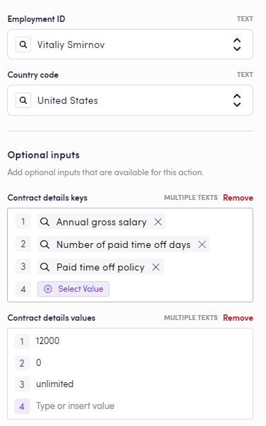

# Blackbird.io Remote

Blackbird is the new automation backbone for the language technology industry. Blackbird provides enterprise-scale automation and orchestration with a simple no-code/low-code platform. Blackbird enables ambitious organizations to identify, vet and automate as many processes as possible. Not just localization workflows, but any business and IT process. This repository represents an application that is deployable on Blackbird and usable inside the workflow editor.

## Introduction

<!-- begin docs -->

**Remote** is a Global HR Platform that helps companies hire, manage, and pay their entire team — and more effectively compete in the modern global economy through our comprehensive set of core solutions including, HRIS, payroll, international employment, contractor management, and more.

## Before setting up

Before you can connect you need to make sure that:

- You have a Remote instance
- You have a Remote API token. You can find a detailed guide on how to get it [here](https://remote.com/resources/api/auth-and-authorization).

## Connecting

1. Navigate to Apps, and identify the **Remote** app. You can use search to find it.
2. Click _Add Connection_.
3. Name your connection for future reference e.g. 'My Remote connection'.
4. Fill in the `Base URL` field. If you are using production environment, you should use `https://gateway.remote.com`. If you are using sandbox environment, you should use `https://gateway.remote-sandbox.com`.
5. Fill in the `API token` you got from Remote.
6. Click **Connect**.
7. Make sure that connection was added successfully.

## Actions

### Employees

- **Search employments** Search employments based on specified criteria.
- **Get employment** Get employment by ID.
- **Create employment** Create employment with specified data.
- **Invite employment** Invite employment by ID to start the self-enrollment.
- **Get employment custom field** Get employment custom field value by ID.
- **Update employment custom field** Update employment custom field value by ID with specified data.
- **Update employment** Update employment by ID with specified data. This action allows you to update employment details by ID with the provided data. When working with contract details, please note that the required properties can vary based on the employee's country.

Steps:

1. Country code: Specify the country code for the employee. This is crucial because each country may require different contract details.
2. Contract details keys (Optional Input): After selecting a country code, a dynamic dropdown will appear allowing you to select relevant contract details keys.
3. Contract details values (Optional Input): Alongside the keys, you must specify the values corresponding to each key. The order of keys and values must match exactly, as they will be merged into an object in the code.

Example:

### Invoices

- **Search invoices** Search invoices based on specified criteria.
- **Get invoice** Get invoice by ID.

### Invoice schedules

- **Search invoice schedules** Search сontractor invoice schedules based on specified criteria.
- **Get invoice schedule** Get сontractor invoice schedule by ID.
- **Create invoice schedule** Create сontractor invoice schedule with specified data.
- **Update invoice schedule** Update сontractor invoice schedule by ID with specified data.
- **Import invoice schedule** Import сontractor invoice schedules from a JSON file. You can export this file from the `Plunet` app for example.

The Remote API processes amounts in cents rather than in the standard currency format. This means that any amount returned by the API will be in cents. For example, an amount of $800 will be represented as 80,000 cents in the API outputs.

### Time offs

- **Get time off** returns details of a specific time off.
- **Create time off** creates a new time off for the employee.
- **Get time off balance** returns the time off balance for the employee.

### Expenses

- **Get expenses** returns all expenses.
- **Get expense** returns details of a specific expense.
- **Create expense** creates a new expense.
- **Download receipt** downloads a receipt file for an expense.

## Events

### Employments

- **On employment activated** This event is triggered whenever an employment user is updated to the active status.
- **On employment onboarding completed** This event is triggered whenever an employment user has completed onboarding.
- **On employment details updated** This event is triggered whenever an employment user's details are updated.
- **On employment personal information updated** This event is triggered whenever an employment user's personal information is updated.
- **On employment status deactivated** This event is triggered whenever an employment user status is updated to inactive.

### Time offs

- **On time off canceled** Triggers when a time off is canceled.
- **On time off declined** Triggers when a time off is declined.
- **On time off requested** Triggers when a time off is requested.
- **On time off date changed** Triggers when a time off has its date changed.
- **On time off approved** Triggers when a time off is approved.

### Custom fields

- **On custom field value updated** This event is triggered whenever a custom field value is updated.

### Invoices

- **On invoices status changed** This event returns invoices that changed status since the last polling time. 
- **On contractor invoice added** This event is triggered whenever a new contractor invoice is added.

Note: Invoice events are based on polling. This means that the event will be triggered based on the polling interval you set in the event configuration.

## Missing features

Remote API is quite extensive and we are working on adding more features to the app. If you are missing a feature, please let us know.

You can check which features are supported by the Remote API [here](https://remote.com/resources/api/reference#section/Authentication).

## Feedback

Do you want to use this app or do you have feedback on our implementation? Reach out to us using the [established channels](https://www.blackbird.io/) or create an issue.

<!-- end docs -->
